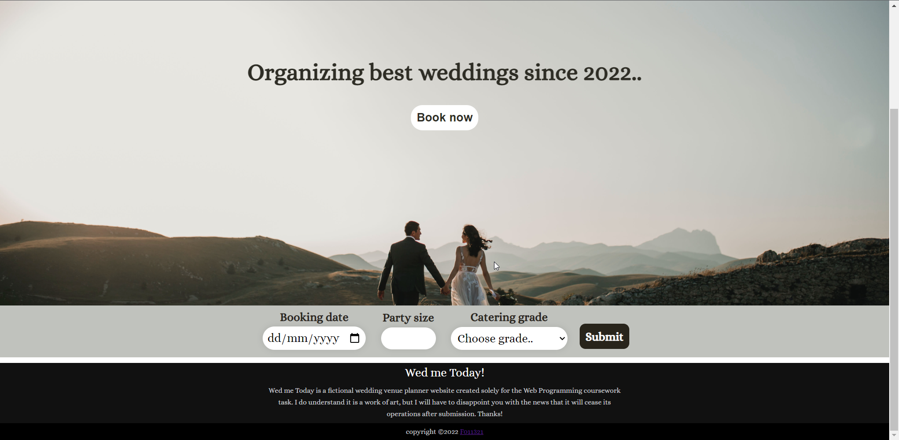
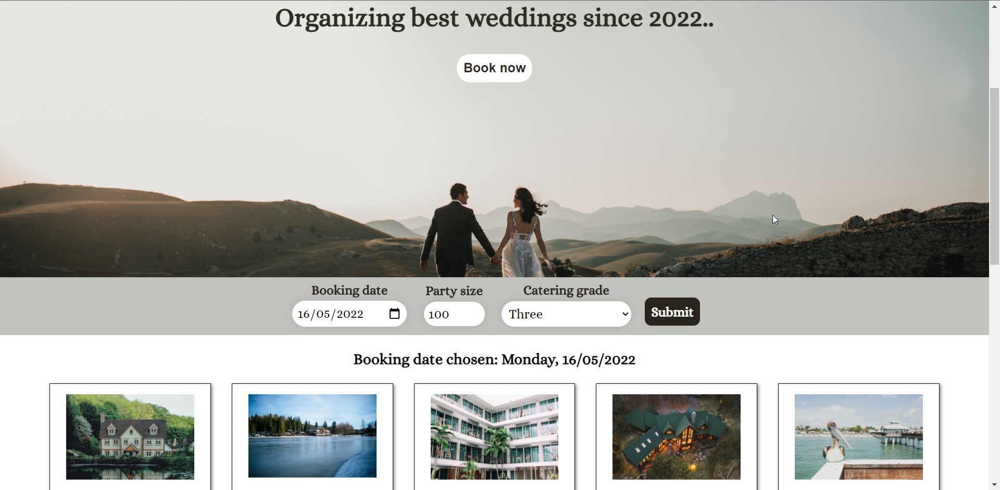
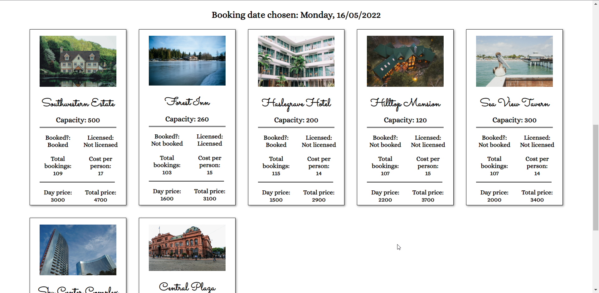
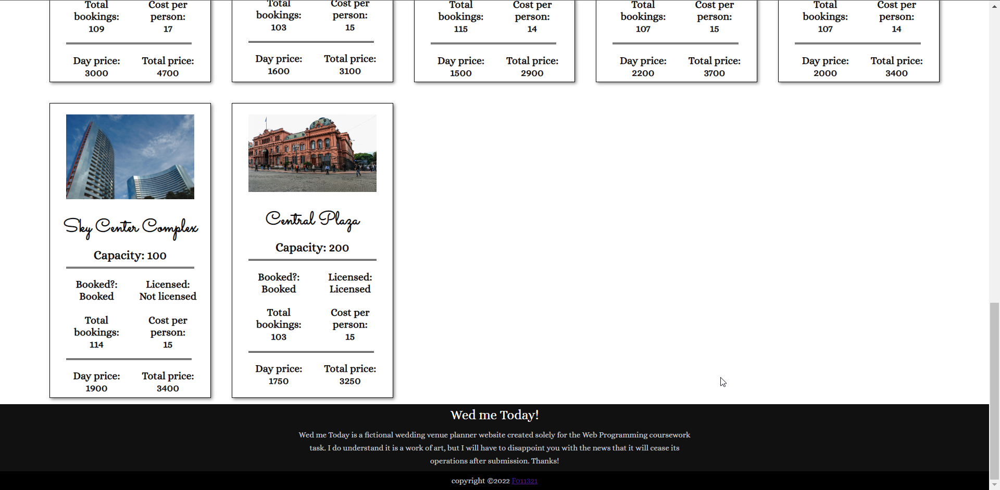

# Web programming Year 1 Coursework 

## Task breakdown

### Task 1 

Write a php script (catering.php) to produce an html page as result which contains a table of catering
costs based on the input of 7 values as follows:
 - min, max (party size, can assume they are multiples of 5)
 - c1, c2, c3, c4, c5 (the cost per person of 5 grades of catering)
The finished table will have rows headed by min to max (incremented in steps of 5) and columns headed
by c1 to c5. 

### Task 2

Write a php script (capacity.php) to list (in an HTML table) the names and venue prices of licensed
venues within a minimum and maximum capacity (inclusive). 

### Task 3

Write a php script (count.php) to list (in an HTML table) the name of venues and their number of
bookings in the given month sorted descending by the number of bookings. 

### Task 4

Design your own webpage (must start from wedding.php) to find suitable wedding venue(s) based on
date, party size and catering grade provided by users

Here are some screenshots of the website built: 

